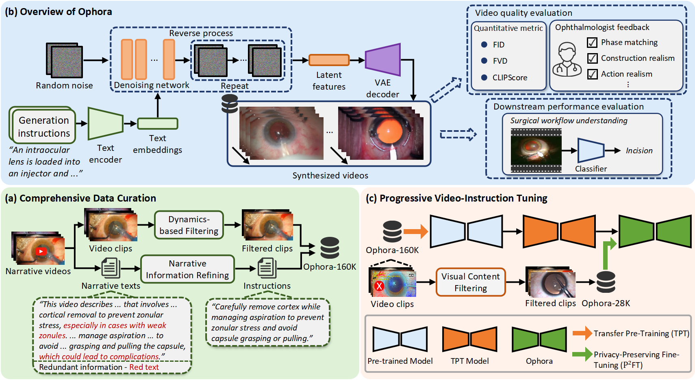

# Ophora: A Large-Scale Data-Driven Text-Guided Ophthalmic Surgical Video Generation Model

**Abstract:** In ophthalmic surgery, developing an AI system capable of interpreting surgical videos and predicting subsequent operations requires numerous ophthalmic surgical videos with high-quality annotations, which are difficult to collect due to privacy concerns and labor consumption. Text-guided video generation (T2V) emerges as a promising solution to overcome this issue by generating ophthalmic surgical videos based on surgeon instructions. In this paper, we present Ophora, a pioneering model that can generate ophthalmic surgical videos following natural language instructions. To construct Ophora, we first propose a Comprehensive Data Curation pipeline to convert narrative ophthalmic surgical videos into a large-scale, high-quality dataset comprising over 160K video-instruction pairs, Ophora-160K. Then, we propose a Progressive Video-Instruction Tuning scheme to transfer rich spatial-temporal knowledge from a T2V model pre-trained on natural video-text datasets for privacy-preserved ophthalmic surgical video generation based on Ophora-160K. Experiments on video quality evaluation via quantitative analysis and ophthalmologist feedback demonstrate that Ophora can generate realistic and reliable ophthalmic surgical videos based on surgeon instructions. We also validate the capability of Ophora for empowering downstream task of ophthalmic surgical workflow understanding.


## Introduction

This repository is for our work submitted to MICCAI25, titled "Ophora: A Large-Scale Data-Driven Text-Guided Ophthalmic Surgical Video Generation Model".

We have released the training and inference codes of Ophora. The model checkpoint and dataset are released.



## Synthesized Videos
<div class="video-container" style="display: flex; flex-wrap: wrap; gap: 20px;">

  <div class="video-item" style="flex: 1 1 45%;">
    <video width="100%" controls>
      <source src="./demo/Anterio-Chamber-Flushing.mp4" type="video/mp4">
    </video>
    <div class="caption">Anterio Chamber Flushing: Simulated procedure demonstrating anterior chamber irrigation during ophthalmic surgery.</div>
  </div>

  <div class="video-item" style="flex: 1 1 45%;">
    <video width="100%" controls>
      <source src="./demo/Capsule-Pulishing.mp4" type="video/mp4">
    </video>
    <div class="caption">Capsule Polishing: Synthesized video showing delicate capsule polishing with micro-instruments.</div>
  </div>

  <div class="video-item" style="flex: 1 1 45%;">
    <video width="100%" controls>
      <source src="./demo/hydrodissection.mp4" type="video/mp4">
    </video>
    <div class="caption">Hydrodissection: Text-guided video generation of hydrodissection phase during cataract surgery.</div>
  </div>

  <div class="video-item" style="flex: 1 1 45%;">
    <video width="100%" controls>
      <source src="./demo/Lens-Implantation.mp4" type="video/mp4">
    </video>
    <div class="caption">Lens Implantation: Generated video illustrating lens implantation following cataract extraction.</div>
  </div>

</div>

## Ophora & Ophora-160K
### Model Checkpoint
We provide model checkpoints for Ophora at the [Ophora repository](https://huggingface.co/General-Medical-AI/Ophora).

### Dataset
The curated large-scale dataset **Ophora-160K** can be accessed at [Ophora-160K datasets](https://huggingface.co/datasets/General-Medical-AI/Ophora-160K).


## Prepare Environment

Training and inference with Ophora require an environment compatible with the CogVideoX-2b model.  
Please refer to its official page for installation instructions and dependencies: [CogVideoX-2b on Hugging Face](https://huggingface.co/THUDM/CogVideoX-2b).


## To prepare dataset for model training
```bash
bash prepare_dataset.sh
```

## Train
Transfer Pre-Training
```bash
bash TPT.sh
```
Privacy-Preserving Fine-tuning
```bash
bash P2FT.sh
```

## Inference

We provide phase captions written by professional ophthalmologists based on the phase labels in the [Cataract-1K](https://github.com/Negin-Ghamsarian/Cataract-1K) dataset.  
You can use the `Cataract-1K-phase_prompts.csv` file for inference.

```bash
bash sample.sh
```

## Citation

```bibtex
@article{li2025ophora,
  title={Ophora: A large-scale data-driven text-guided ophthalmic surgical video generation model},
  author={Li, Wei and Hu, Ming and Wang, Guoan and Liu, Lihao and Zhou, Kaijin and Ning, Junzhi and Guo, Xin and Ge, Zongyuan and Gu, Lixu and He, Junjun},
  journal={arXiv preprint arXiv:2505.07449},
  year={2025}
}